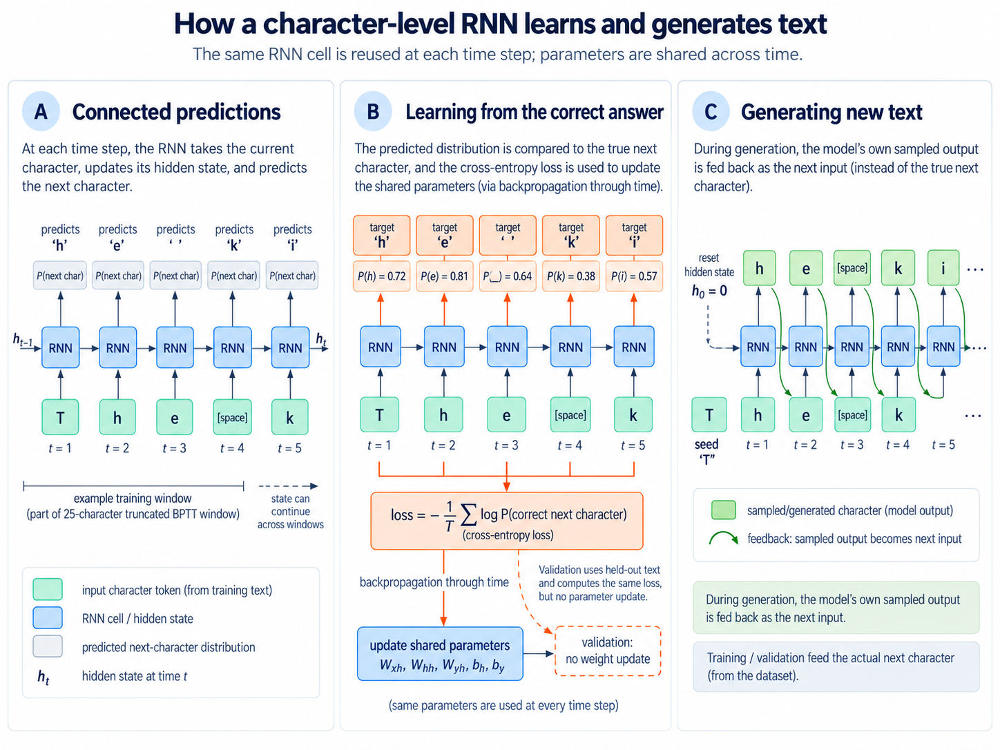

# min-char-rnn in base R

A small, CPU-only character-level language model implemented in R, following the mathematics of Andrej Karpathy's [minimal recurrent neural network](https://gist.github.com/karpathy/d4dee566867f8291f086) from 2015 which he discussed [here](https://karpathy.github.io/2015/05/21/rnn-effectiveness/) and [here](https://github.com/karpathy/char-rnn).


Python is the standard language for much of modern AI development, but it is not required to build a neural network. We work extensively in R, so this project reconstructs the learning algorithm in **base R** rather than using a pretrained model or delegating its calculations to a deep-learning framework. The forward pass, loss, backpropagation through time and parameter updates are implemented explicitly with R matrix operations. No Python bridge, GPU or automatic differentiation is required. `ggplot2` is used only for optional monitoring plots.

The objective is to understand a complete, trainable model, not to reproduce the capabilities of a modern Transformer. The implementation retains Karpathy's core architecture and adds a held-out validation split, readable training logs, generated samples, saved checkpoints and numerical gradient tests.




## Quick test

These three scripts test and run the project.

```sh
Rscript tests/test_model.R
Rscript experiments/run.R --smoke
Rscript experiments/run.R
```

## How the model learns

A character-level language model learns to predict the next character in a text sequence. The text itself supplies the training targets: in `The king`, the character after `T` is `h`, the character after `h` is `e`, and so on.

| Current character | Correct next character |
|---|---|
| `T` | `h` |
| `h` | `e` |
| `e` | space |
| space | `k` |
| `k` | `i` |
| `i` | `n` |
| `n` | `g` |

The program identifies the distinct characters in the input text, assigns each one a deterministic, **one-based** R index and converts each input character into a one-hot vector. Spaces, punctuation, case and newlines are preserved.

The recurrent network combines the current character with a *hidden state* carrying information from preceding characters. At each step it calculates:

```text
h_t = tanh(Wxh x_t + Whh h_(t-1) + bh)
y_t = Why h_t + by
p_t = softmax(y_t)
```

Here `x_t` is the one-hot input, `h_t` is the new hidden state, and `p_t` gives a probability for every possible next character. The same parameter matrices are reused at every position; only the input and hidden state change.

| Parameter | Role |
|---|---|
| `Wxh` | Input-to-hidden weights |
| `Whh` | Hidden-to-hidden recurrent weights |
| `Why` | Hidden-to-output weights |
| `bh`, `by` | Hidden and output biases |

Training penalises the network according to the probability it assigned to the **actual** next character. The loss at one position is `-log(p_t[correct character])`; a higher probability for the correct character gives a lower loss. Backpropagation through time calculates gradients for all five parameter objects, and AdaGrad uses those gradients to update the parameters. For each parameter element, the update has the form:

```text
memory = memory + gradient^2
parameter = parameter - learning_rate * gradient / sqrt(memory + 1e-8)
```

The reference configuration uses **100 hidden units**, **25-character training windows**, and a learning rate of **0.1**. Gradients are propagated backward through each window and clipped element-wise to `[-5, 5]`. The final hidden state can be carried into the following window, but the gradient calculation stops at the boundary. With a 65-character vocabulary, the network contains **23,165 trainable parameters**.

Training, validation and text generation use the same network in different ways. **Training** reads the actual text and updates the parameters. **Validation** reads held-out text and measures its prediction loss without updating the parameters. **Generation** starts from a seed character and repeatedly feeds the model's *own sampled character* back as the next input. See [How validation works](docs/02_validation.md) for a short worked example.

## Requirements and quick start

You need R with `Rscript` available on the command line. The model and tests use base R and the standard `tools` package; training runs on a CPU. The only optional R package is **`ggplot2` 3.4 or later**, used for plots and the browser-based training monitor:

```r
install.packages("ggplot2")
```

From the project root, check the model and run the bundled small-corpus smoke test:

```sh
Rscript tests/test_model.R
Rscript experiments/run.R --smoke --no-plot
```

The smoke test uses `data/input.txt`, a network with 16 hidden units, 12-character windows and 30 updates. It tests the complete training pipeline without downloading a large corpus. The model tests also check numerical stability, saved-model round trips and analytical gradients against finite differences. If you have installed `ggplot2`, you can additionally check the monitoring code:

```sh
Rscript tests/test_monitoring.R
```

For a short, plotted experiment on Tiny Shakespeare:

```sh
Rscript experiments/run.R --iterations=5000
```

If `data/tiny_shakespeare.txt` is missing, the runner downloads it from Karpathy's [char-rnn repository](https://github.com/karpathy/char-rnn). An internet connection is needed for that first download only. The full corpus is kept locally and excluded from Git; the small smoke-test corpus is included in the repository. Use `--no-plot` for a run without `ggplot2`.

To train on your own UTF-8 plain-text file or change the experiment settings:

```sh
Rscript experiments/run.R \
  --input=data/my_input.txt \
  --hidden-size=100 \
  --seq-length=25 \
  --lr=0.1 \
  --iterations=5000 \
  --seed=42
```

The `--iterations` argument specifies the **total number of parameter updates**, not the number of passes through the corpus. You can request a longer experiment, for example `--iterations=50000`, but more updates do not guarantee improved validation loss or more coherent generated text.

## Monitoring and interpreting a run

Each experiment creates a timestamped directory under `output/`. The console and `experiment.log` report the configuration, training progress, elapsed time, estimated completion time and periodic training and validation losses. `samples.txt` records generated passages at different stages of learning.

With plotting enabled, open the run's `training.html` file in a browser. It refreshes every 10 seconds and shows `training.png` (the full learning curves) and `validation_detail.png` (recent validation measurements). Opening or closing the browser does not control training. To recreate plots from a completed run:

```sh
Rscript experiments/plot_results.R output/YOUR_EXPERIMENT_DIRECTORY
```

**Loss is measured in nats per character; lower is better.** A predictor assigning equal probability to all `V` vocabulary characters has loss `log(V)`, or about **4.174** for a vocabulary of 65 characters. The training curve displays exponentially smoothed loss from recent training windows, divided by sequence length.

Validation calculates the average next-character loss on a **fixed held-out passage**, starting with a reset hidden state and without changing the model. By default, this is the first **2,000 character transitions** of the validation split, not the whole held-out corpus. Training and validation curves therefore use different samples and smoothing conventions; their difference should not be treated as a precise generalisation-gap estimate. Generated passages are a separate qualitative measure: better next-character prediction does not by itself imply coherent prose.

The runner also retains the model from the **lowest measured validation loss**. That checkpoint may be more useful for inspection than the model obtained at the final update. The [50,000-update experiment notes](docs/03_interpretation.md) discuss an example in which validation performance improved, deteriorated sharply, recovered and then deteriorated again.

## Stop, resume and save results

For a clean stop, create a `STOP` file in the active run's output directory from another terminal:

```sh
touch output/YOUR_EXPERIMENT_DIRECTORY/STOP
```

The runner checks for the marker at a monitoring interval, saves its current state and exits. This is not an immediate interrupt. Remove the marker and resume with a new **total** update target:

```sh
rm output/YOUR_EXPERIMENT_DIRECTORY/STOP
Rscript experiments/run.R \
  --resume=output/YOUR_EXPERIMENT_DIRECTORY \
  --iterations=100000
```

Resumption requires a `latest_checkpoint.rds` produced by the resumable runner. The input, vocabulary, model dimensions, learning rate and sequence length must remain unchanged. A saved `model.rds` by itself does not contain the complete training state needed to resume.

A typical experiment directory contains:

| File | Purpose |
|---|---|
| `experiment.log`, `metadata.rds` | Configuration, R version, random seed, corpus checksum and run details |
| `metrics.csv` | Training and validation measurements, elapsed time and approximate corpus passes |
| `samples.txt` | Periodically generated text |
| `best_model.rds` | Model weights at the lowest recorded validation loss |
| `model.rds` | Model weights at the end of the latest run |
| `latest_checkpoint.rds` | Full resumable state, including AdaGrad memory, text position, hidden state and RNG state |
| `vocab.rds` | Saved character vocabulary |
| `training.png`, `validation_detail.png`, `training.html` | Optional plots and browser monitor |

To load a saved model and vocabulary in R:

```r
source("R/model.R")
source("R/data.R")

model <- load_model("output/YOUR_EXPERIMENT_DIRECTORY/model.rds")
vocab <- load_vocab("output/YOUR_EXPERIMENT_DIRECTORY/vocab.rds")
```

The run records its seed, R environment details, configuration and input checksum so an experiment can be repeated under matching conditions. Output directories and the downloaded Shakespeare corpus are **not committed to Git**. Keep selected figures for publication in `docs/` instead.

## Repository structure

| Path | Purpose |
|---|---|
| `R/model.R` | Network mathematics, gradients, AdaGrad, sampling and gradient checking |
| `R/data.R` | UTF-8 input, vocabulary, encoding, train/validation split and checksum |
| `R/progress.R` | Logs, elapsed time and progress reporting |
| `R/plots.R` | Optional learning curves and browser monitor |
| `experiments/run.R` | Experiment configuration, training, validation, samples and checkpoints |
| `experiments/plot_results.R` | Render or watch experiment plots |
| `tests/` | Model and monitoring tests |
| `data/input.txt` | Small bundled corpus for smoke tests |
| `docs/` | Worked explanations and selected figures |
| `output/` | Local experiment results, excluded from Git |

## References

This project follows the model and training logic of Andrej Karpathy's [*min-char-rnn.py*](https://gist.github.com/karpathy/d4dee566867f8291f086) and his article [*The Unreasonable Effectiveness of Recurrent Neural Networks*](https://karpathy.github.io/2015/05/21/rnn-effectiveness/). The default Tiny Shakespeare corpus is from his [char-rnn repository](https://github.com/karpathy/char-rnn).

This is an R implementation of an established vanilla RNN architecture, not a claim of a new model design. The contribution of this learning project is a complete, readable implementation of the network mathematics together with the experiment tools needed to observe and reproduce its behaviour.


