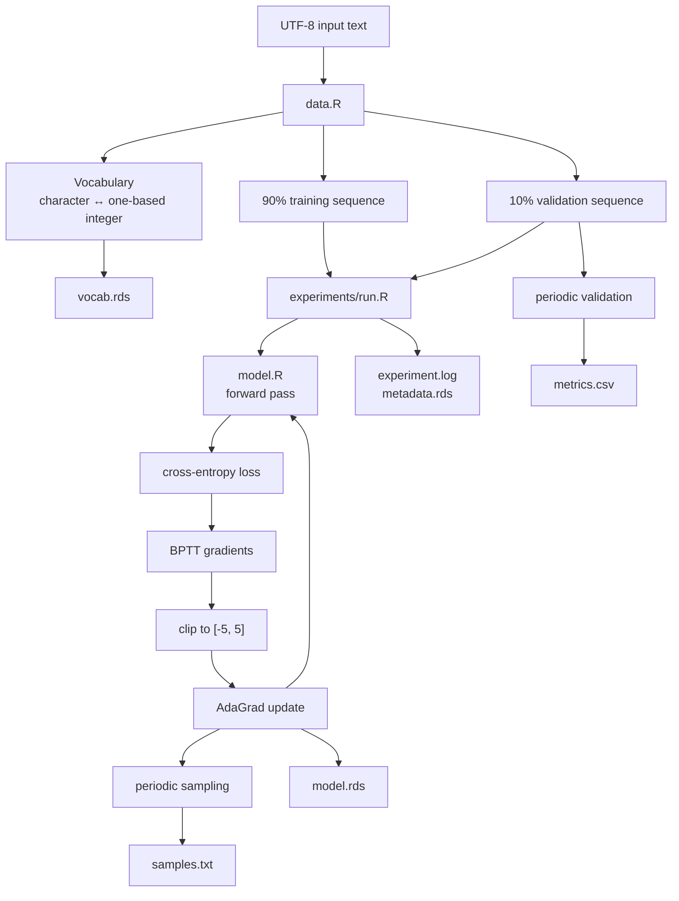
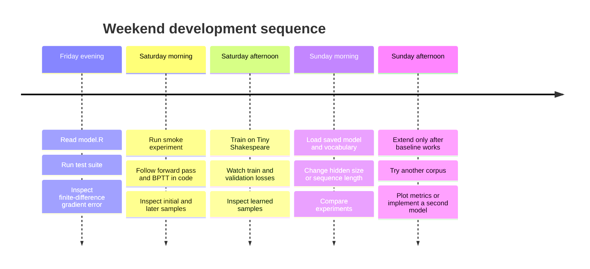

# CPU-only min-char-rnn in R: complete educational project

## Executive summary

The project is assembled as a complete, small R codebase that reproduces the mathematical core of Andrej Karpathy's `min-char-rnn.py`: one-hot character inputs, the five learned parameter objects `Wxh`, `Whh`, `Why`, `bh`, `by`, a tanh recurrent state, softmax cross-entropy, backpropagation through time, element-wise gradient clipping to `[-5, 5]`, AdaGrad and autoregressive character sampling. Karpathy's original Gist contains this entire training algorithm in one short NumPy program. citeturn1view0

The project deliberately keeps those calculations visible rather than hiding them behind `torch`, TensorFlow, Keras or automatic differentiation. That makes it a substantially better laptop-scale learning exercise than attempting to reproduce something such as AlexNet, whose original paper reports five to six days of training on two GTX 580 GPUs. fileciteturn0file1 Karpathy likewise presented the minimal RNN specifically as an educational implementation of character-level language modelling, where the task is to predict the next character from previous characters and then recursively sample predictions to generate text. citeturn0search0

The agreed separation between the model, data handling, progress reporting, experiment wrapper and tests is preserved. fileciteturn0file0 The neural-network mathematics live almost entirely in `R/model.R`, so that file can be read from top to bottom as the implementation of the model.

The downloadable archive is here:

**[Download min-char-rnn-r-project.zip](sandbox:/mnt/data/min-char-rnn-r-project.zip)**

The archive contains the complete source shown below. It has no R package dependencies. The training program uses base R plus `tools::md5sum()`, which is part of R's standard distribution. R's documented `saveRDS()` and `readRDS()` interface is used for model and vocabulary persistence, `set.seed()` is used for reproducible random-number generation, and the input checksum is recorded for experiment identification. citeturn3search1turn3search3turn1view2

One qualification is important. The execution environment available while assembling this report did not contain an R interpreter, and its system package manager could not obtain one because external package resolution was unavailable. I therefore could not execute the R test suite here. I did perform structural checks on all R source files and independently checked the BPTT equations with a numerical finite-difference implementation, which produced a maximum relative gradient error of about \(1.05\times10^{-6}\) on the small test case. The included R test suite repeats that verification in R and should be the first command run locally.

## Research and design decisions

Karpathy's original implementation initialises `Wxh`, `Whh` and `Why` with Gaussian values scaled by `0.01`, sets `bh` and `by` to zero, uses a hidden size of 100, sequence length 25 and learning rate 0.1, and propagates the state according to \(h_t=\tanh(W_{xh}x_t+W_{hh}h_{t-1}+b_h)\). It calculates output logits with `Why`, applies softmax, accumulates negative log-likelihood, backpropagates through the sequence, clips each gradient element between -5 and 5, and updates every parameter with AdaGrad using an epsilon of \(10^{-8}\). citeturn1view0

The R implementation retains that model while making a few deliberate engineering changes:

| Area | Karpathy minimal implementation | This R project |
|---|---|---|
| Character indices | Python zero-based | R one-based |
| Vocabulary ordering | Python `set`, effectively implementation dependent | sorted, deterministic |
| Softmax | direct `exp(y)` | max-shifted stable softmax |
| Cross-entropy | `-log(p[target])` | log-sum-exp equivalent |
| Hidden size | 100 | 100 default |
| Sequence length | 25 | 25 default |
| Learning rate | 0.1 | 0.1 default |
| Optimiser | AdaGrad | AdaGrad |
| Gradient clipping | element-wise `[-5, 5]` | element-wise `[-5, 5]` |
| Training termination | infinite loop | configurable iteration count |
| Validation | none | contiguous held-out 10% |
| Progress | sample/loss every 100 steps | concise loss, ETA, progress and samples |
| Persistence | none | model, vocabulary, metrics and metadata |
| Correctness check | none | central finite-difference gradient check |
| Runtime backend | NumPy | base R matrices |
| GPU requirement | none in minimal Gist | none |

The numerically stable softmax is not a different model. Subtracting the largest logit before exponentiation cancels algebraically in the softmax ratio. The corresponding cross-entropy is evaluated as

\[
\log\left(\sum_j e^{y_j}\right)-y_{\text{target}}
\]

using the same maximum shift. This avoids overflow from very large logits while preserving the intended probability calculation.

The validation set is deliberately contiguous rather than randomly shuffled. A recurrent language model learns a sequence, so retaining text order is the clearer experiment. Periodic validation evaluates a fixed prefix of the held-out region, rather than the entire validation corpus at every logging event, to prevent evaluation from dominating CPU training. The validation data never update parameters.

Tiny Shakespeare is the normal default corpus. Karpathy's `char-rnn` repository explicitly distributes `data/tinyshakespeare` as its example dataset and describes the model as taking a single text file and learning to predict characters. The current source file is about 1.06 MB with 40,000 lines. citeturn5search8turn5search0 The project also contains a tiny `data/input.txt`, so `--smoke` works without downloading anything.

For reproducibility, the project records `R.version.string`, RNG kind, seed, input checksum and complete configuration. R's documentation specifically recommends `set.seed()` for reproducible random generation and notes that RNG configuration can matter across R versions, which is why recording only the integer seed would be insufficient. citeturn3search1turn4search2

## Project structure and execution flow

| File | Responsibility |
|---|---|
| `R/model.R` | Model initialisation, forward loss, BPTT, clipping, AdaGrad, sampling, model save/load, numerical gradient checker |
| `R/data.R` | UTF-8 input, deterministic vocabulary, one-based encoding, decoding, train/validation split, MD5, vocabulary save/load |
| `R/progress.R` | Concise logging, duration formatting, progress bar and ETA |
| `experiments/run.R` | CLI, configuration, dataset setup, complete training loop, validation, samples and outputs |
| `tests/test_model.R` | Base-R unit-style tests and finite-difference gradient verification |
| `data/input.txt` | Bundled tiny input for immediate smoke testing |
| `scripts/create_zip.R` | Recreates the distributable archive |
| `README.md` | Project documentation |

The model is intentionally not an R package yet. That keeps the first version readable while retaining clean module boundaries. If it later becomes a package, `model.R`, `data.R` and `progress.R` can move almost unchanged into an `R/` package directory.



The useful weekend sequence is to establish mathematical correctness before spending time on training.



## Complete project files

**`R/model.R`**

**`R/data.R`**


**`R/progress.R`**


R's `Sys.time()` returns the system date-time, and `difftime()` provides explicitly requested elapsed-second differences, so the ETA calculation uses standard R timing primitives rather than adding a timing package. citeturn4search3turn4search1

**`experiments/run.R`**


**`tests/test_model.R`**


The model/vocabulary round-trip test uses the standard R single-object serialisation API. R's own documentation describes `saveRDS()` and `readRDS()` as the interface for writing a single object and restoring it later, including under another name. citeturn3search3

**`scripts/create_zip.R`**


R documents `utils::zip()` as a wrapper around an external `zip` command, which is why packaging is the one place where a system utility is required. It is not required for training, testing, sampling or loading saved models. citeturn4search0

**`data/input.txt`**


**`README.md`**


## Running, observing and evaluating the model

The first command should be the mathematical test suite:

```sh
cd min-char-rnn
Rscript tests/test_model.R
```

The significant test is not merely whether the code runs. `finite-difference gradients` independently perturbs every parameter in a deliberately tiny network and estimates

\[
\frac{\partial L}{\partial\theta_i}
\approx
\frac{L(\theta_i+\epsilon)-L(\theta_i-\epsilon)}
{2\epsilon}.
\]

It then compares those numerical derivatives against the manually implemented BPTT gradients for `Wxh`, `Whh`, `Why`, `bh` and `by`. Gradient clipping is disabled during this test because the derivative of the unclipped loss is what must be checked.

A successful run should have this general form. The exact timing and gradient error will depend on the machine:

```text
min-char-rnn test suite

[PASS] encode/decode round trip             0.001s
[PASS] model parameter dimensions           0.001s
[PASS] stable softmax                       0.000s
[PASS] forward/backward dimensions          0.002s
       max relative error: 1.0e-06
[PASS] finite-difference gradients          0.020s
[PASS] AdaGrad changes parameters            0.002s
[PASS] sampling returns valid indices        0.002s
[PASS] save/load model and vocabulary        0.004s

All tests passed.
```

The next experiment is intentionally tiny:

```sh
Rscript experiments/run.R --smoke
```

A representative console structure is:

```text
2026-09-19 14:30:00 CEST | START    | min-char-rnn | base R | CPU-only
2026-09-19 14:30:00 CEST | CONFIG   | R: R version ...
2026-09-19 14:30:00 CEST | CONFIG   | input=data/input.txt | md5=...
2026-09-19 14:30:00 CEST | CONFIG   | hidden=16 | seq=12 | lr=0.1 | iterations=30 | seed=42 ...
2026-09-19 14:30:00 CEST | STAGE    | [1/5] Preparing data
2026-09-19 14:30:00 CEST | DATA     | characters=2220 | vocabulary=... | train=1998 | validation=222
2026-09-19 14:30:00 CEST | STAGE    | [2/5] Initialising model
2026-09-19 14:30:00 CEST | MODEL    | Vanilla RNN | parameters=... | optimiser=AdaGrad | gradient clip=[-5,5]
2026-09-19 14:30:00 CEST | MODEL    | uniform baseline=... | initial validation=...

... initial random sample ...

2026-09-19 14:30:00 CEST | STAGE    | [3/5] Training
2026-09-19 14:30:00 CEST | TRAIN    | [========................]  33.3% | 10/30 | elapsed 00:00 | ETA 00:00 | train=... | val=... | ... iter/s

... sampled text ...

2026-09-19 14:30:00 CEST | TRAIN    | [================........]  66.7% | 20/30 | elapsed 00:00 | ETA 00:00 | train=... | val=... | ... iter/s
2026-09-19 14:30:00 CEST | TRAIN    | [========================] 100.0% | 30/30 | elapsed 00:00 | ETA 00:00 | train=... | val=... | ... iter/s
2026-09-19 14:30:00 CEST | STAGE    | [4/5] Final evaluation
2026-09-19 14:30:00 CEST | EVAL     | initial validation=... | final validation=... nats/char
2026-09-19 14:30:00 CEST | STAGE    | [5/5] Saving results
2026-09-19 14:30:00 CEST | DONE     | experiment complete | total elapsed 00:01
```

The values above are illustrative rather than fabricated test results. The real run computes every number.

The normal experiment is then simply:

```sh
Rscript experiments/run.R
```

With no explicit input path, that fetches Karpathy's Tiny Shakespeare example on first use and subsequently reuses the local copy. The source repository describes this corpus as its bundled example dataset. citeturn5search8turn5search0

The defaults are:

| Hyperparameter | Value | Reason |
|---|---:|---|
| `hidden_size` | 100 | matches minimal Gist |
| `seq_length` | 25 | matches minimal Gist |
| `lr` | 0.1 | matches minimal Gist |
| `iterations` | 5,000 | bounded laptop experiment |
| `seed` | 42 | reproducible experiment |
| `log_interval` | 100 | enough feedback without console noise |
| `sample_interval` | 500 | visible qualitative learning checkpoints |
| `sample_length` | 200 | same scale as original sample output |
| validation fraction | 10% | held-out sequential evaluation |
| validation characters | 2,000 | limits CPU evaluation overhead |
| weight SD | 0.01 | matches minimal Gist |
| gradient clip | 5 | matches minimal Gist |
| AdaGrad epsilon | \(10^{-8}\) | matches minimal Gist |

The original minimal Gist has no fixed stopping condition, because its loop is `while True`; bounding the R experiment by an explicit iteration count is therefore an experiment-control addition rather than a change to the network. citeturn1view0

For a small CPU project, reasonable planning estimates are a few seconds for the smoke run, under a few seconds for most tests, roughly 1 to 10 minutes for 5,000 updates at hidden size 100, and roughly 5 to 40 minutes for 20,000 updates. These are deliberately broad estimates because small matrix multiplication performance varies materially with CPU and the BLAS library used by a particular R installation. The program's measured `iter/s`, elapsed time and ETA should replace those estimates as soon as the first 100 iterations complete. Karpathy's broader character-RNN work also notes that CPU training is slower than GPU training for his larger Torch models, although the vanilla model here is far smaller and is specifically constrained for laptop use. citeturn0search0

The most educational outputs are `metrics.csv` and `samples.txt`. The loss tells you whether the probability model is improving numerically; the samples let you see what that improvement means behaviourally. Karpathy's original article explicitly demonstrates this progression, with samples initially resembling random character sequences and later acquiring spaces, punctuation, word structure and longer patterns as training proceeds. citeturn0search0

## Reproducibility, limitations and packaging

There are two meanings of "reproduce Karpathy's min-char-rnn", and keeping them separate matters.

This project **reproduces the algorithm**: the same five parameter sets, recurrence, softmax objective, BPTT structure, gradient clipping, AdaGrad and sampling procedure. Those operations can be compared directly with the original Gist. citeturn1view0

It does **not promise bit-for-bit agreement with the Python program**. R uses one-based indices, this implementation deliberately sorts the vocabulary instead of inheriting the arbitrary ordering of a Python `set`, R and NumPy have different random-number generators, and the stable softmax computes the same mathematical expression through a safer numerical route. Those differences should alter the precise learned weight values while preserving the experiment being studied.

The generated experiment directory contains:

```text
output/<timestamp>_seed42/
├── experiment.log
├── metadata.rds
├── metrics.csv
├── model.rds
├── samples.txt
└── vocab.rds
```

`metadata.rds` records the seed, RNG kind, R version, input path, input MD5, configuration, parameter count, corpus sizes, baseline loss and final loss. R documents both the RNG interfaces and version string used here, while `tools::md5sum()` computes file checksums specifically for identifying file content. citeturn3search1turn4search2turn1view2

A small but useful reproducibility detail is that periodic text sampling temporarily sets a deterministic sampling seed and then restores the previous RNG state. Sampling therefore cannot change the subsequent training trajectory. At present the training loop itself has no stochastic operation after parameter initialisation, but isolating sample RNG state prevents an educational feature from silently becoming part of the optimiser state if the project is extended later.

The one external system dependency is optional packaging. R's official `utils::zip()` documentation states that it delegates archive creation to an external `zip` command. citeturn4search0 Training itself remains base-R-only.

From the project root:

```sh
Rscript scripts/create_zip.R
```

Or, from the parent directory:

```sh
zip -r min-char-rnn.zip min-char-rnn \
  -x 'min-char-rnn/output/*' \
     'min-char-rnn/data/tiny_shakespeare.txt'
```

This project: a neural language model whose entire forward computation, loss, backpropagation, optimiser and sampling procedure can be read directly in R, whose gradients can be independently checked rather than trusted, and whose learning can be observed both numerically and through generated text.
